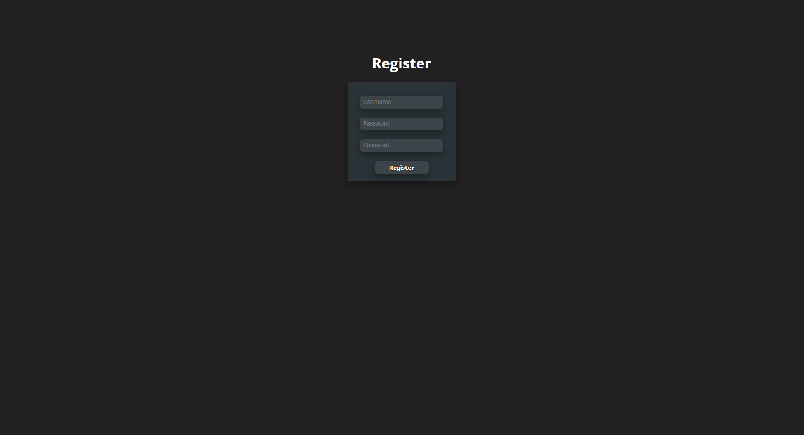

# Investment Tracker

## Layout

## About
- The program allows an individual or individuals to track their stock investments.
- You will need access to an API key to get the live stock quotes so you can get an accurate PnL summary. The code supports API keys from a website called Tiingo.
- This program is a a web app written in C# with ASP.NET for the backend and TypeScript with React for the frontend.
- The database is PostgreSQL.
- The application uses JWTs and Refresh tokens to handle authentication and the authentication is handled by this application and not a thrid party.
- The backend also has a python script that is run using a cron job that will compute your daily PnL and so that it can be later displayed on the frontend to the user.

## Build and Run
- Since this program uses Docker the build process is very easy.
- First off though you will need to generate your own TLS certificates as this program uses https
1. Run `docker compose build`
1. Run `docker compose up`
